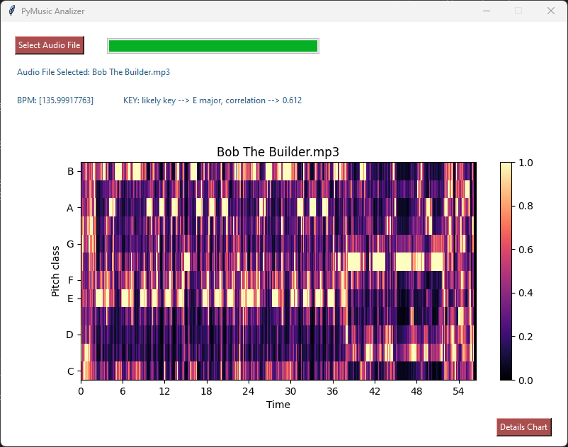

# PYMUSIC ANALYZER
Simple python app for retrieving BMP and KEY from an audio file.<br>
It is based on the `librosa` python library and inspired from `jackmcarthur/musical-key-finder` GitHub repo.<br>
The complete python script is in `gui.py` file.

## SCREENSHOT


## HOW TO
1. click on the top-left button `Select Audio File`
2. the analyzer starts automatically after imported the audio
3. the progress bar fills itself while the process is on working
4. then at the right of titles `BPM` and `KEY` will appear computed values of respective objects
5. lastly will be printed the chromagram of the import audio
6. click on the bottom-right button `Details Chart` to open a dedicated window of the chromagram, rendered by `pyplot.show()` function

## PACKAGING AND DEPLOYING
The python application can be packaged and deployed using `pyinstaller` python module.<br>
As mentioned in the official documentation, *PyInstaller bundles a Python application and all its dependencies into a single package. The user can run the packaged app without installing a Python interpreter or any modules.*<br>

```python
pyinstaller --onefile --windowed gui.py
```

**Attention**: PyInstaller is tested against Windows, MacOS X, and Linux. However, it is not a cross-compiler; to make a Windows app you run PyInstaller on Windows, and to make a Linux app you run it on Linux, etc.

## USEFUL LINKS
- [jackmcarthur/musical-key-finder](https://github.com/jackmcarthur/musical-key-finder)
- [librosa docs](https://librosa.org/doc/latest/index.html)
- [pyinstaller docs](https://pyinstaller.org/en/stable/index.html)